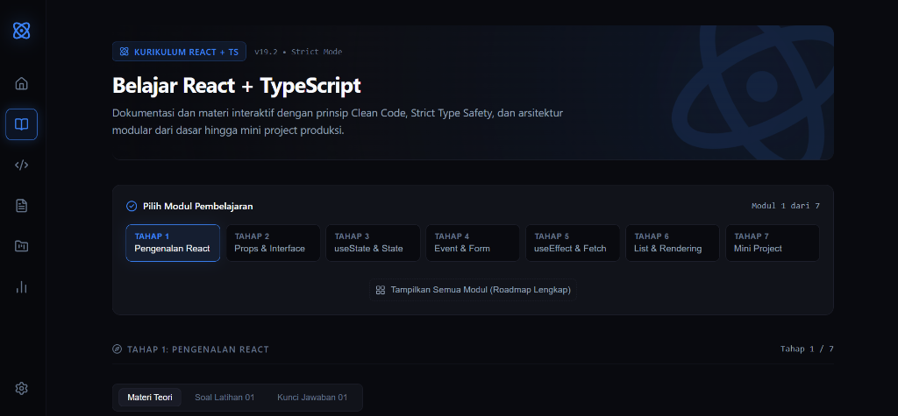

<div align="center">

# learn-react-typescript

Kurikulum interaktif dan panduan komprehensif belajar React modern + TypeScript untuk pemula dengan pendekatan Clean Code dan Type-Safe.

[](https://react.dev/)
[](https://www.typescriptlang.org/)
[](https://vitejs.dev/)
[](https://oxc.rs/)
[](./LICENSE)
[]()

</div>

---

## Preview



> *Tampilan antarmuka Dashboard Interaktif Kurikulum Pembelajaran React + TypeScript.*

---

## Deskripsi Singkat

**learn-react-typescript** adalah repositori pembelajaran interaktif React modern dan TypeScript murni yang dibangun menggunakan Vite bundler. Repositori ini dirancang khusus untuk memandu pemula memahami konsep fundamental React dengan standar *Clean Code*, *Strict Type Safety*, dan penjelasan mendalam berbahasa Indonesia dari tahap pengenalan hingga pembuatan mini project aplikasi siap produksi. Proyek ini merupakan kelanjutan praktis langsung dari repositori fondasi [learn-typescript](https://github.com/Jouqio/learn-typescript).

---

## Daftar Isi (Table of Contents)

- [Preview](#preview)
- [Deskripsi Singkat](#deskripsi-singkat)
- [Tech Stack](#tech-stack)
- [Prerequisites (Prasyarat)](#prerequisites-prasyarat)
- [Instalasi & Setup](#instalasi--setup)
- [Available Scripts (Perintah yang Tersedia)](#available-scripts-perintah-yang-tersedia)
- [Struktur Folder](#struktur-folder)
- [Cara Mengerjakan Latihan](#cara-mengerjakan-latihan)
- [Progress / Roadmap Belajar](#progress--roadmap-belajar)
- [Design System & UI Intentional](#design-system--ui-intentional)
- [Konfigurasi Oxlint & Bundler](#konfigurasi-oxlint--bundler)
- [Related Repositories (Repositori Terkait)](#related-repositories-repositori-terkait)
- [Lisensi](#lisensi)
- [Penulis](#penulis)

---

## Tech Stack

Proyek ini dibangun menggunakan versi pustaka modern dan type-safe yang terkonfirmasi pada `package.json`:

- **[React](https://react.dev/) (`^19.2.8`)**: Library JavaScript deklaratif untuk antarmuka pengguna berbasis komponen.
- **[React DOM](https://react.dev/) (`^19.2.8`)**: Entry point DOM renderer untuk React pada platform web.
- **[TypeScript](https://www.typescriptlang.org/) (`~6.0.2`)**: Static typing superset JavaScript untuk validasi kontrak data dan type safety ketat.
- **[Vite](https://vitejs.dev/) (`^8.2.2`)**: Next-generation frontend tool & bundler dengan Hot Module Replacement (HMR) berkecepatan tinggi.
- **[@vitejs/plugin-react](https://github.com/vitejs/vite-plugin-react) (`^6.1.0`)**: Plugin resmi React Vite yang ditenagai oleh Oxc engine.
- **[lucide-react](https://lucide.dev/) (`^1.39.0`)**: Koleksi ikon SVG modern dengan stroke yang konsisten.
- **[Oxlint](https://oxc.rs/) (`^1.79.0`)**: Linter JavaScript/TypeScript berkecepatan tinggi dari ekosistem Oxc.

---

## Prerequisites (Prasyarat)

Sebelum menjalankan proyek ini di komputer lokal, pastikan Anda telah menginstal:

- **[Node.js](https://nodejs.org/)**: Minimal versi `v18.0.0` atau yang lebih baru (disarankan menggunakan versi `v20+ LTS`).
- **[npm](https://www.npmjs.com/)**: Bawaan dari instalasi Node.js (atau package manager alternatif seperti pnpm / yarn).
- **Git**: Untuk mengkloning repositori.

---

## Instalasi & Setup

Ikuti langkah-langkah berikut untuk menjalankan repositori di lokal:

1. **Clone repositori ini:**
   ```bash
   git clone https://github.com/Jouqio/learn-react-typescript.git
   ```

2. **Masuk ke direktori proyek:**
   ```bash
   cd learn-react-typescript
   ```

3. **Install seluruh dependensi:**
   ```bash
   npm install
   ```

4. **Jalankan development server:**
   ```bash
   npm run dev
   ```

5. **Buka aplikasi di browser:**
   Buka peramban web Anda dan akses alamat lokal:
   ```
   http://localhost:5173
   ```

---

## Available Scripts (Perintah yang Tersedia)

Di dalam direktori proyek, Anda dapat menjalankan perintah-perintah berikut:

| Perintah | Fungsi / Kegunaan |
| :--- | :--- |
| `npm run dev` | Menjalankan Vite development server lokal dengan Hot Module Replacement (HMR). Buka di `http://localhost:5173`. |
| `npm run build` | Menjalankan type-checking TypeScript via `tsc -b` lalu mengompilasi bundel produksi yang telah dioptimasi ke folder `dist/`. |
| `npm run preview` | Menjalankan web server lokal untuk menguji dan meninjau hasil build produksi dari folder `dist/` sebelum dideploy. |
| `npm run lint` | Menjalankan static code analysis menggunakan **Oxlint** untuk mendeteksi potensi bug, error hooks, dan kepatuhan clean code. |

---

## Struktur Folder

Berikut adalah arsitektur direktori modul pembelajaran di dalam `src/pembelajaran/`:

```plaintext
src/
├── App.css                           # Stylesheet modern technical documentation
├── App.tsx                           # Root Component & Interactive Curriculum Stepper
├── index.css                         # Design tokens, CSS variables, & baseline resets
├── main.tsx                          # Entry point aplikasi (createRoot React DOM)
└── pembelajaran/                     # Modul Materi Kurikulum Terstruktur
    ├── LatihanRunner.tsx             # Interactive runner untuk memilih & menguji seluruh latihan (1-7)
    ├── common/
    │   └── CodeComparison.tsx        # Komponen komparasi visual "Anti-Pattern vs Best Practice"
    ├── 01-kenalan/                   # TAHAP 1: Dasar React & Vite
    │   ├── HelloWorld.tsx            # Pengenalan JSX/TSX, Function Component, & Fragment
    │   ├── StrukturProjectExplainer.tsx # Diagram alur rendering & panduan struktur file
    │   └── latihan/                  # Latihan Mandiri & Kunci Jawaban
    │       ├── latihan-01.tsx        # Soal latihan (komponen dengan TODO terstruktur)
    │       └── jawaban-01.tsx        # Kunci jawaban resmi lengkap + alasan arsitektur
    ├── 02-props/                     # TAHAP 2: Props & Typing Interface
    │   ├── PropsExplainer.tsx        # Konsep aliran data satu arah & typing interface
    │   ├── UserCard.tsx              # Praktik komponen profil reusable dengan static typing
    │   └── latihan/                  # Latihan Mandiri & Kunci Jawaban
    │       ├── latihan-02.tsx        # Soal latihan (Props, interface, optional ?, default value)
    │       └── jawaban-02.tsx        # Kunci jawaban resmi lengkap + alasan arsitektur
    ├── 03-state/                     # TAHAP 3: useState & Reaktivitas
    │   ├── StateExplainer.tsx        # Perbedaan Props vs State & bahaya mutasi langsung
    │   ├── Counter.tsx               # Praktik komponen interaktif dengan updater function
    │   └── latihan/                  # Latihan Mandiri & Kunci Jawaban
    │       ├── latihan-03.tsx        # Soal latihan (Multiple state, updater function, toggle)
    │       └── jawaban-03.tsx        # Kunci jawaban resmi lengkap + alasan arsitektur
    ├── 04-events/                    # TAHAP 4: Event Handling & Form
    │   ├── EventExplainer.tsx        # SyntheticEvent, typing e: React.MouseEvent / FormEvent
    │   ├── SimpleNameForm.tsx        # Controlled form, real-time input, validasi, & e.preventDefault()
    │   └── latihan/                  # Latihan Mandiri & Kunci Jawaban
    │       ├── latihan-04.tsx        # Soal latihan (onChange, onSubmit, e.preventDefault, validasi)
    │       └── jawaban-04.tsx        # Kunci jawaban resmi lengkap + alasan arsitektur
    ├── 05-effects/                   # TAHAP 5: useEffect & HTTP Fetching
    │   ├── EffectExplainer.tsx       # Side effects, siklus hidup mount/update, & 3 dependency array
    │   ├── PostListFetcher.tsx       # Praktik konsumsi REST API publik, status loading & error
    │   └── latihan/                  # Latihan Mandiri & Kunci Jawaban
    │       ├── latihan-05.tsx        # Soal latihan (useEffect, fetch API, loading & error state)
    │       └── jawaban-05.tsx        # Kunci jawaban resmi lengkap + alasan arsitektur
    ├── 06-rendering/                 # TAHAP 6: Conditional & List Rendering
    │   ├── RenderingExplainer.tsx    # Operator ternary, logical AND, gotcha angka 0, & aturan prop key
    │   ├── SimpleTodoList.tsx        # Looping array dengan .map(), filter agenda, & immutable updates
    │   └── latihan/                  # Latihan Mandiri & Kunci Jawaban
    │       ├── latihan-06.tsx        # Soal latihan (.map, unique key id, empty state, filter)
    │       └── jawaban-06.tsx        # Kunci jawaban resmi lengkap + alasan arsitektur
    └── 07-mini-project/              # TAHAP 7: Mini Project Akhir (TaskFlow App)
        ├── TodoListApp.tsx           # Container utama pengelola state daftar tugas terpusat
        ├── TodoForm.tsx              # Komponen form input tugas & validasi mandiri
        ├── TodoItemRow.tsx           # Baris item tugas, checkbox toggle, & tombol hapus
        ├── TodoFilterBar.tsx         # Bilah navigasi filter status & pembersih tugas selesai
        ├── types.ts                  # Kontrak tipe data terpusat (TaskItem, TaskPriority, TaskFilter)
        └── latihan/                  # Latihan Mandiri & Kunci Jawaban
            ├── latihan-07.tsx        # Soal mini project 2 (Catatan Belanja / Shopping List)
            └── jawaban-07.tsx        # Kunci jawaban resmi lengkap + ulasan arsitektur
```

---

## Cara Mengerjakan Latihan

Setiap tahap materi dilengkapi dengan subfolder `latihan/` yang berisi pasangan file: **`latihan-XX.tsx`** (soal untuk Anda kerjakan sendiri) dan **`jawaban-XX.tsx`** (kunci jawaban resmi berstandar Clean Code).

Berikut alur belajar yang direkomendasikan:

1. **Pahami Materi Teori**: Buka tahap modul yang sedang dipelajari di aplikasi lokal (`http://localhost:5173`) atau baca kode penjelasan di dalam folder tahap tersebut (misal `01-kenalan/`).
2. **Buka File Soal**: Masuk ke subfolder `latihan/` dan buka file soal, contoh:
   ```
   src/pembelajaran/01-kenalan/latihan/latihan-01.tsx
   ```
3. **Isi Komentar `// TODO:`**: 
   - Seluruh file latihan sudah valid secara TypeScript dan dapat langsung dijalankan tanpa error di browser (lewat tab **"Soal Latihan"** di header modul).
   - Baca instruksi di setiap baris `// TODO:`, lalu ganti nilai *placeholder* sementara dengan kode Anda sendiri.
4. **Cek Hasil di Browser**: Buka peramban di `http://localhost:5173` pada tab latihan terkait untuk melihat pembaruan tampilan antarmuka secara *live*.
5. **Bandingkan dengan Kunci Jawaban**:
   - Jika sudah selesai, atau jika Anda mengalami kebuntuan (*stuck*), buka file:
     ```
     src/pembelajaran/01-kenalan/latihan/jawaban-01.tsx
     ```
   - Pelajari **alasan di balik penulisan kode** pada komentar penjelasan dan perhatikan bagian **"Kesalahan Umum Pemula"** di akhir file untuk menghindari kebiasaan buruk (*anti-pattern*).

---

## Progress / Roadmap Belajar

Berikut adalah seluruh daftar capaian materi dan checklist kurikulum yang telah diselesaikan:

- [x] **Tahap 1: Pengenalan React & Struktur Project**
  - [x] Memahami apa itu React, Component, dan JSX/TSX.
  - [x] Aturan Single Root Element dan penggunaan React Fragment (`<> ... </>`).
  - [x] Alur rendering dari `index.html` ➔ `main.tsx` ➔ `App.tsx` ➔ Component.
  - [x] Panduan file konfigurasi (`package.json`, `tsconfig.json`, `vite.config.ts`).
- [x] **Tahap 2: Props & Typing Interface**
  - [x] Pengenalan aliran data satu arah (Parent ➔ Child).
  - [x] Sifat Props yang Read-Only (Immutable).
  - [x] Mendefinisikan kontrak tipe data komponen dengan `interface` TypeScript.
  - [x] Props Destructuring dan penerapan Default Value pada parameter opsional.
  - [x] Komparasi Anti-Pattern (tipe `any`) vs Best Practice (TypeScript `interface`).
- [x] **Tahap 3: useState (Data Dinamis & Reaktivitas)**
  - [x] Konsep memori internal komponen melalui hook `useState`.
  - [x] Perbedaan mendasar antara Props (eksternal) dan State (internal).
  - [x] Bahaya mutasi state langsung (`count = count + 1`) tanpa setter function.
  - [x] Penggunaan Updater Function (`setCount(prev => prev + 1)`) untuk batch update yang aman.
  - [x] Membuktikan independensi state antar-instansi komponen yang sama.
- [x] **Tahap 4: Event Handling & Form Input**
  - [x] Memahami SyntheticEvent di React vs Event Handler bawaan HTML.
  - [x] Typing handler di TypeScript (`React.MouseEvent`, `React.ChangeEvent`, `React.FormEvent`).
  - [x] Aturan passing referensi fungsi (bukan eksekusi langsung di JSX).
  - [x] Penerapan `e.preventDefault()` pada penanganan submit formulir.
  - [x] Membangun Controlled Component dengan validasi input real-time.
- [x] **Tahap 5: useEffect & Asynchronous Data Fetching**
  - [x] Memahami konsep Side Effects (efek samping di luar pure rendering).
  - [x] Memahami 3 pola dependency array: tanpa array, array kosong `[]`, dan array bervariabel `[deps]`.
  - [x] Bahaya infinite loop saat memanggil fetch langsung di badan fungsi komponen.
  - [x] Menangani 3 status data fetching: *Loading*, *Error*, dan *Success*.
  - [x] Typing respons REST API publik (JSONPlaceholder) dengan Interface.
- [x] **Tahap 6: Conditional & List Rendering**
  - [x] 3 teknik conditional rendering: Ternary Operator, Logical AND (`&&`), dan Early Return guard clause.
  - [x] Menghindari gotcha angka 0 saat mengevaluasi kondisi `count && <Komponen />`.
  - [x] Looping data array menjadi elemen JSX menggunakan method `.map()`.
  - [x] Aturan emas prop `key`: mengapa wajib menggunakan ID unik dan bukan index array.
  - [x] Pembaruan status item dalam array secara immutable.
- [x] **Tahap 7: Mini Project Akhir — TaskFlow (Todo List App)**
  - [x] Integrasi utuh materi Tahap 1 hingga Tahap 6 dalam satu aplikasi nyata.
  - [x] Pemisahan arsitektur berbasis *Single Responsibility Principle* (`TodoForm`, `TodoItemRow`, `TodoFilterBar`).
  - [x] Sentralisasi kontrak tipe data di file tersendiri (`types.ts`).
  - [x] Operasi immutable array lengkap: Prepend item baru, Toggle status, Delete item, dan Clear completed.
  - [x] Filter status multi-kategori (*Semua*, *Aktif*, *Selesai*) dan visual feedback terukur.

---

## Design System & UI Intentional

Antarmuka kurikulum ini dirancang secara sengaja (*Intentional Design*) mengikuti standar dokumentasi teknis modern (seperti *Linear*, *Vercel Docs*, dan *Stripe Docs*), dengan menghilangkan seluruh ciri *AI Slop*:

- **Satu Palet Warna Terukur**: Menggunakan basis Slate/Zinc Dark Theme (`#090a0f`, `#11131a`, `#1e202c`) dengan **Satu Warna Aksen Tunggal: Electric Azure (`#3b82f6`)** untuk elemen aktif dan navigasi. Bebas dari gradient ungu-biru yang berlebihan.
- **Ikonografi Konsisten**: Tidak menggunakan emoji teks sebagai pengganti icon. Seluruh ikon menggunakan pustaka murni [`lucide-react`](https://lucide.dev/) dengan stroke dan proporsi seimbang.
- **Pola Visual "Anti-Pattern vs Best Practice"**: Menampilkan blok komparasi kode dua kolom yang elegan dengan border kiri tipis (merah lembut untuk anti-pattern, hijau lembut untuk best practice) tanpa latar belakang warna terang yang menyilaukan mata.
- **Hierarki & Ergonomi Membaca**: Dilengkapi dengan *Interactive Curriculum Stepper* sehingga materi yang sedang dipelajari tampil menonjol dan fokus, lengkap dengan tombol navigasi *Sebelumnya / Selanjutnya* dan opsi tinjauan seluruh roadmap.
- **Animasi CSS Murni**: Animasi mikro seperti spinner loading didefinisikan secara manual via `@keyframes spin` di `index.css` tanpa ketergantungan pada library utilitas eksternal.

---

## Konfigurasi Oxlint & Bundler

Proyek ini telah dikonfigurasi dengan linter generasi baru **Oxlint** (`oxlint`) dari Oxc engine. Jika Anda ingin mengaktifkan *type-aware lint rules* untuk pengembangan tingkat lanjut, Anda dapat memasang `oxlint-tsgolint` dan menyesuaikan konfigurasi pada [`.oxlintrc.json`](./.oxlintrc.json):

```json
{
  "$schema": "./node_modules/oxlint/configuration_schema.json",
  "plugins": ["react", "typescript", "oxc"],
  "options": {
    "typeAware": true
  },
  "rules": {
    "react/rules-of-hooks": "error",
    "react/only-export-components": ["warn", { "allowConstantExport": true }]
  }
}
```

> **Catatan React Compiler**: React Compiler secara bawaan dinonaktifkan pada template dasar ini untuk menjaga kecepatan maksimal Hot Module Replacement (HMR). Untuk mengaktifkannya, silakan rujuk [Dokumentasi Resmi React Compiler](https://react.dev/learn/react-compiler/installation).

---

## Related Repositories (Repositori Terkait)

- **[learn-typescript](https://github.com/Jouqio/learn-typescript)**: Repositori fondasi bahasa pemrograman TypeScript murni (sintaks dasar, interface, generics, utility types, dan object-oriented programming).
- **[learn-nodejs]** *(Segera Hadir)*: Kelanjutan kurikulum backend server-side, RESTful API, dan arsitektur database.

---

## Lisensi

 **[MIT](./LICENSE)**

---

## Penulis

Dibuat dengan fokus pada Clean Code dan Rekayasa Frontend Terstruktur oleh:

- **Syauqi Nuzul Abdi** [@Jouqio](https://github.com/Jouqio)
